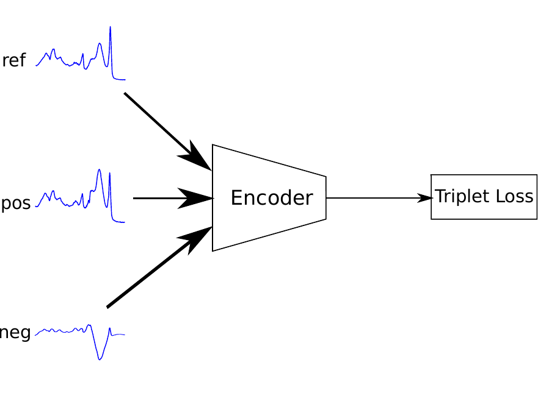
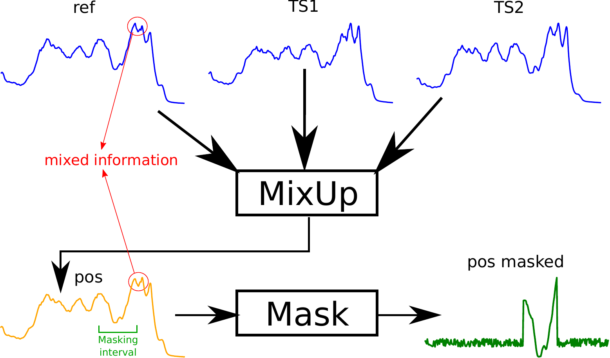
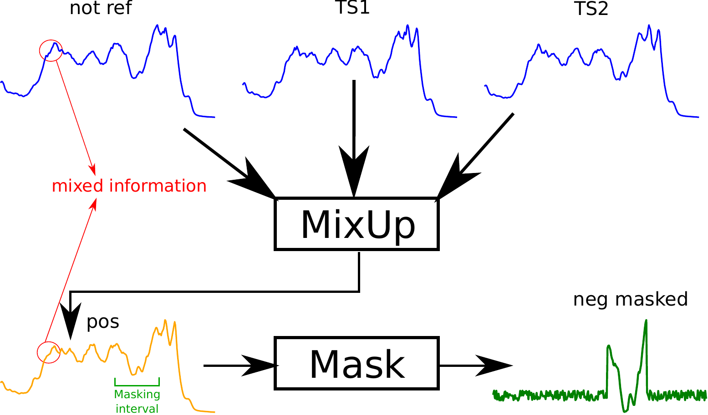
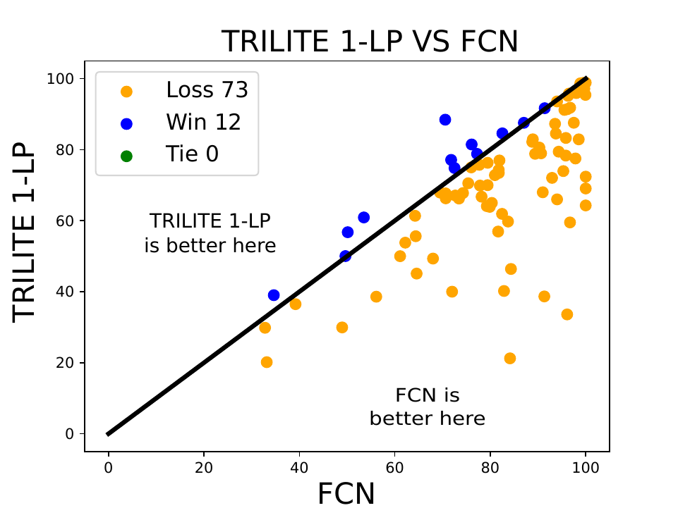
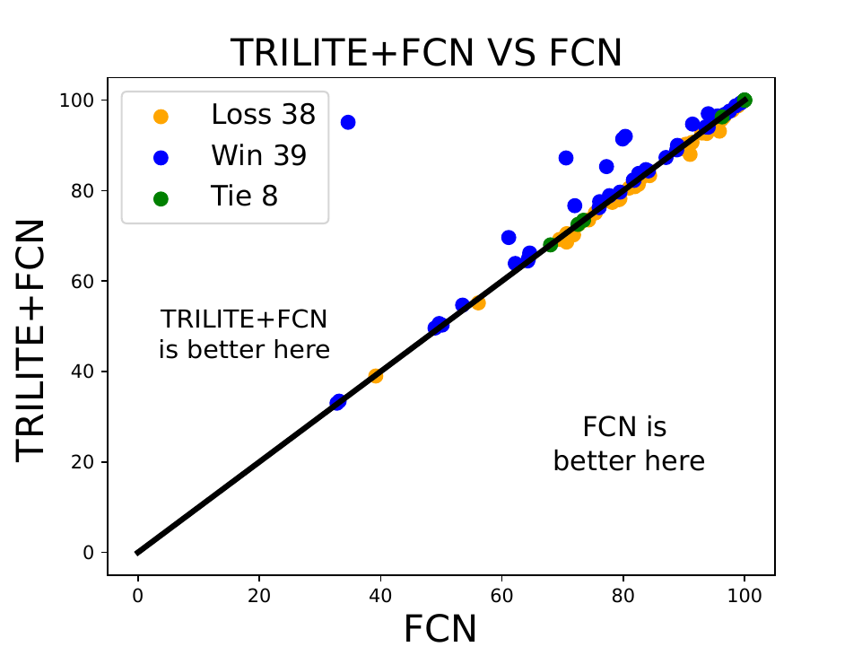
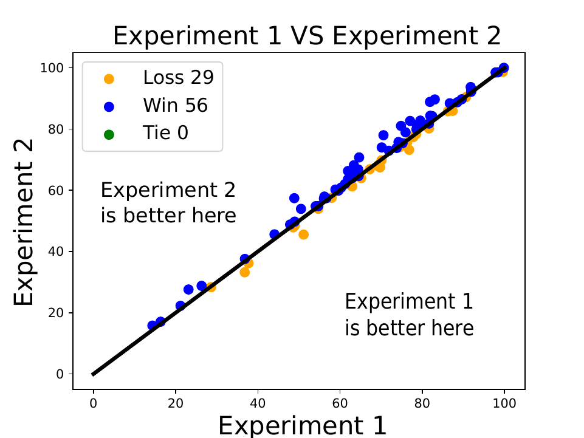
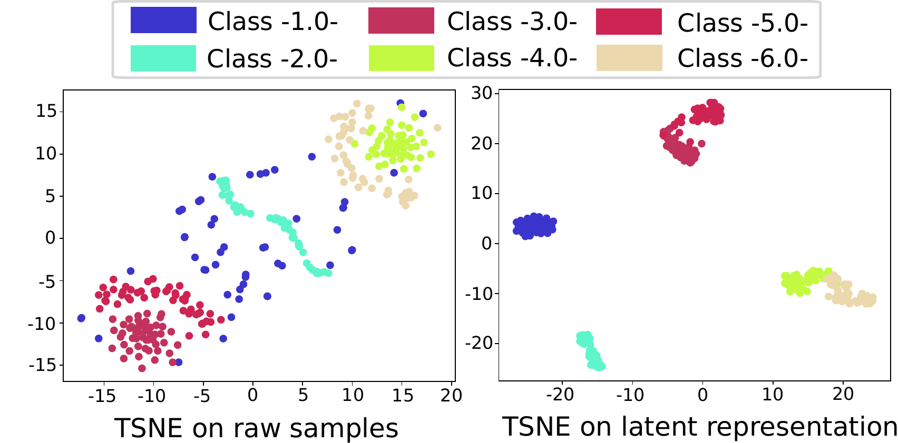

# Enhancing Time Series Classification with Self-Supervised Learning

This is the code of our paper "Enhancing Time Series Classification with Self-Supervised Learning" accepted as short paper at [2023 15th International Conference on Agents and Artificial Interlligence](https://icaart.scitevents.org/). <br> This work was done by [Ali Ismail-Fawaz](https://hadifawaz1999.github.io/), [Maxime Devanne](https://maxime-devanne.com/), [Jonathan Weber](https://www.jonathan-weber.eu/) and [Germain Forestier](https://germain-forestier.info/).

## Triplet Loss Mechanism

<p align='center'>

</p>

## Triplet Generation

### Positive Samples

<p align='center'>

</p>

### Negative Samples

<p align='center'>

</p>

## Dataset

This model has been tested on the 85 univariate time series datasets of the [UCRArchive](https://www.cs.ucr.edu/%7Eeamonn/time_series_data_2018/)

## Usage of code

To run the code of the TRILITE model on a dataset of the UCRArchive, simply run ```python3 main.py -e fcn -d Coffee```

To run the code on the TRILITE model in a semi-supervised way on a dataset of the UCRArchive,<br /> simply run ```python3 main_semi_supervised.py -e fcn -d Coffee -p 30```, ```-p``` is to specify the percentage of the semi-supervised split.

To apply classication on the results, simply run ```python3 apply_classifier -e fcn -o results/ -d Coffee``` or <br /> 
```python3 apply_classifier -e fcn -o results_semi_30/ -d Coffee``` to apply classification on the semi-supervised split results.

To avoid running each time on one dataset at the time, simply use the bash files ```run_ucr.sh```, ```run_semi_ucr.sh``` and ```run_classifier_ucr.sh``` for each case.

### Adaptation of Code

The change that should be done is the directory in which the datasets are stored.
The variable to be changed is [this line](https://github.com/MSD-IRIMAS/TRILITE/blob/e860e5b657cf8daf127862fde781ec1de86f2fcb/utils/utils.py#L23) ```folder_path```.

## Results

### TRILITE with a Fully Connected Layer Classifier

<p align='center'>

</p>

### TRILITE+FCN with a Fully Connected Layer Classifier (+ means concatenation of features)

<p align='center'>

</p>

### TRILITE+FCN in a Semi-Supervised environment with a RIDGE Classifier

<p align='center'>

</p>

### Latent Space Representation in 2D using TRILITE on the SyntheticControl Dataset of the UCR archive

<p align='center'>

</p>

## Reference

If you use this code, please cite our paper:

```
@inproceedings{ismail-fawaz2022trilite,
  author = {Ismail-Fawaz, Ali and Devanne, Maxime and Weber, Jonathan and Forestier, Germain},
  title = {Enhancing Time Series Classification with Self-Supervised Learning},
  booktitle = {15th International Conference on Agents and Artificial Intelligence: ICAART 2023},
  city = {Lisbon},
  country = {Portugal},
  pages = {1--8},
  year = {2023},
  publisher={SciTePress},
  organization = {INSTICC}
}
```